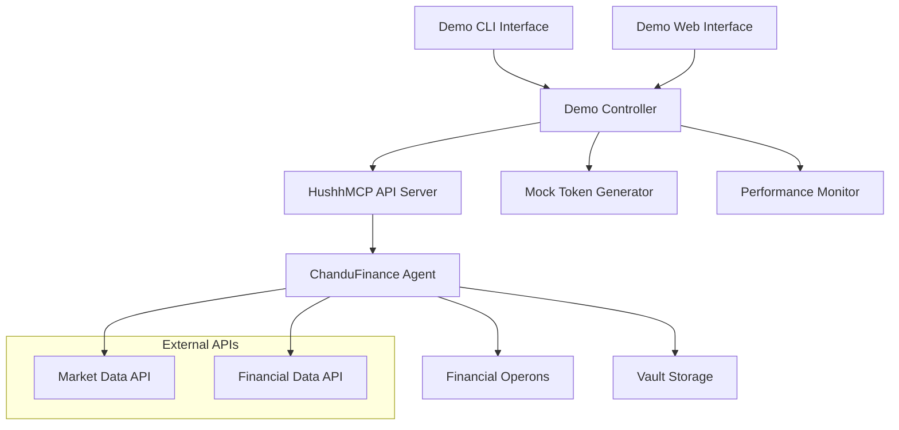

# Design Document

## Overview

The Financial Agent Demo will be a comprehensive interactive demonstration application that showcases the ChanduFinance agent's sophisticated financial analysis capabilities. The demo will provide both a command-line interface and a web-based interface to demonstrate DCF valuation, sensitivity analysis, market comparison, and investment recommendations in real-time.

The demo architecture will leverage the existing HushhMCP API server (running on port 8002) and create additional demo-specific components that provide an intuitive user experience while maintaining full compliance with the HushhMCP consent management protocol.

## Architecture

### System Components



### Technology Stack

- **Backend**: Python 3.8+ with FastAPI (existing API server)
- **CLI Demo**: Rich library for enhanced terminal UI
- **Web Demo**: Simple HTML/JavaScript frontend
- **Data Storage**: File-based vault system (existing)
- **API Communication**: HTTP REST calls to existing endpoints

## Components and Interfaces

### 1. Demo Controller (`demo_controller.py`)

**Purpose**: Central orchestrator for demo operations

**Key Methods**:
- `initialize_demo()` - Set up demo environment and tokens
- `run_stock_analysis(ticker, analysis_type)` - Execute financial analysis
- `generate_sample_data()` - Create realistic demo data
- `monitor_performance()` - Track response times and metrics

**Interfaces**:
- Input: User commands, stock tickers, analysis parameters
- Output: Formatted analysis results, performance metrics
- External: HushhMCP API server endpoints

### 2. CLI Demo Interface (`cli_demo.py`)

**Purpose**: Interactive command-line demonstration

**Features**:
- Rich terminal UI with colors and formatting
- Real-time progress indicators
- Interactive menu system
- Performance metrics display

**Key Components**:
- Command parser for natural language input
- Results formatter with tables and charts
- Error handling with helpful suggestions
- Session management for multiple analyses

### 3. Web Demo Interface (`web_demo/`)

**Purpose**: Browser-based demonstration interface

**Structure**:
```
web_demo/
├── index.html          # Main demo page
├── styles.css          # Demo styling
├── demo.js            # Demo logic and API calls
└── assets/            # Images and resources
```

**Features**:
- Single-page application
- Real-time API communication
- Interactive charts for sensitivity analysis
- Responsive design for mobile/desktop

### 4. Mock Token Generator (`token_generator.py`)

**Purpose**: Generate valid HushhMCP consent tokens for demo

**Functionality**:
- Create tokens with appropriate scopes
- Simulate token validation
- Handle token expiration
- Support multiple user scenarios

### 5. Performance Monitor (`performance_monitor.py`)

**Purpose**: Track and display demo performance metrics

**Metrics Tracked**:
- API response times
- Analysis completion rates
- Token validation success rates
- User interaction patterns

## Data Models

### Demo Session
```python
@dataclass
class DemoSession:
    session_id: str
    user_id: str
    start_time: datetime
    analyses_performed: List[AnalysisResult]
    performance_metrics: PerformanceMetrics
    active_tokens: Dict[str, str]
```

### Analysis Result
```python
@dataclass
class AnalysisResult:
    ticker: str
    analysis_type: str
    execution_time: float
    fair_value: Optional[float]
    recommendation: Optional[str]
    confidence_score: float
    raw_response: Dict[str, Any]
```

### Performance Metrics
```python
@dataclass
class PerformanceMetrics:
    total_requests: int
    average_response_time: float
    success_rate: float
    token_validation_time: float
    data_processing_time: float
```

## Error Handling

### Error Categories

1. **API Communication Errors**
   - Server unavailable
   - Network timeouts
   - Invalid responses

2. **Token Validation Errors**
   - Expired tokens
   - Invalid scopes
   - Malformed tokens

3. **Financial Data Errors**
   - Invalid ticker symbols
   - Missing financial data
   - Calculation failures

4. **User Input Errors**
   - Invalid commands
   - Missing parameters
   - Out-of-range values

### Error Recovery Strategies

- **Automatic Retry**: For transient network issues
- **Graceful Degradation**: Use cached data when APIs fail
- **User Guidance**: Provide helpful error messages and suggestions
- **Fallback Options**: Offer alternative analysis methods

## Testing Strategy

### Unit Tests
- Individual component functionality
- Mock API responses
- Token generation and validation
- Performance metric calculations

### Integration Tests
- End-to-end demo workflows
- API server communication
- Multi-step analysis processes
- Error handling scenarios

### Demo Validation Tests
- Sample stock analyses
- Performance benchmarks
- User experience flows
- Cross-platform compatibility

### Test Data
- Predefined stock tickers (AAPL, MSFT, GOOGL, TSLA)
- Mock financial statements
- Simulated market conditions
- Performance baselines

## Implementation Phases

### Phase 1: Core Demo Infrastructure
- Demo controller setup
- Mock token generation
- Basic API communication
- Performance monitoring foundation

### Phase 2: CLI Demo Interface
- Rich terminal UI implementation
- Interactive command processing
- Results formatting and display
- Error handling and recovery

### Phase 3: Financial Analysis Integration
- Complete DCF valuation demos
- Sensitivity analysis visualization
- Market comparison features
- Investment recommendation display

### Phase 4: Web Interface
- HTML/CSS/JavaScript frontend
- Real-time API integration
- Interactive charts and graphs
- Mobile-responsive design

### Phase 5: Advanced Features
- Natural language command processing
- Batch analysis capabilities
- Export functionality
- Demo session recording

## Security Considerations

### Token Management
- Secure token generation for demo purposes
- Proper scope validation
- Token expiration handling
- Demo-specific token isolation

### Data Protection
- No real financial data exposure
- Secure vault operations
- Audit trail for demo activities
- Privacy-compliant logging

### API Security
- Rate limiting compliance
- Input validation
- Error message sanitization
- Secure communication protocols

## Performance Requirements

### Response Time Targets
- Stock analysis: < 3 seconds
- Token validation: < 100ms
- UI updates: < 50ms
- Demo initialization: < 1 second

### Scalability Considerations
- Support for concurrent demo sessions
- Efficient memory usage
- Minimal resource footprint
- Graceful performance degradation

## User Experience Design

### CLI Interface Flow
1. Welcome screen with available options
2. Stock ticker input with validation
3. Analysis type selection
4. Real-time progress display
5. Comprehensive results presentation
6. Option to perform additional analyses

### Web Interface Flow
1. Landing page with demo overview
2. Interactive stock selection
3. Analysis configuration panel
4. Live progress indicators
5. Rich results visualization
6. Export and sharing options

### Error Handling UX
- Clear, actionable error messages
- Suggested next steps
- Automatic recovery where possible
- Help documentation integration