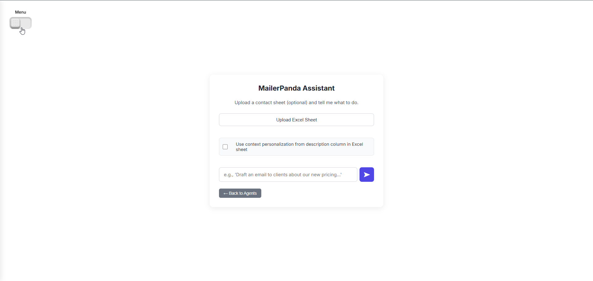
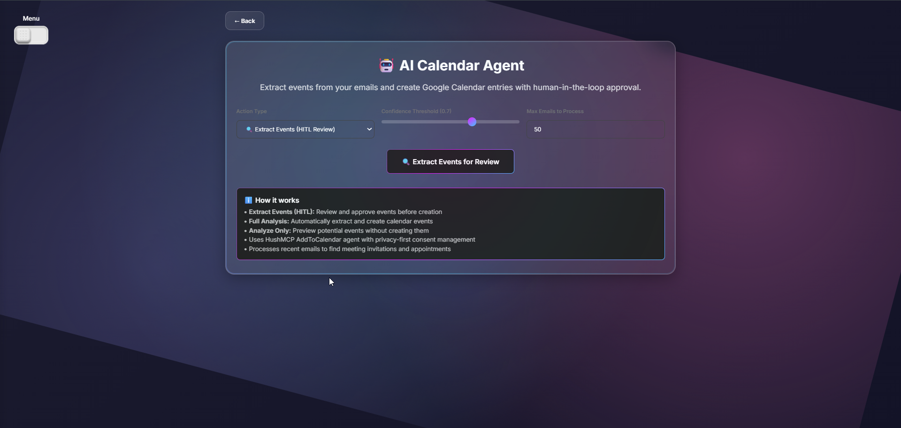

<div align="center">

# Hushh AI Agent Ecosystem
*Smart AI agents that work together while respecting your privacy.*

</div>

### Inspiration 
Imagine having a team of AI assistants that actually understand your needs and work together seamlessly. **Hushh AI Agent Ecosystem** is a collection of smart AI agents that help you with email marketing, financial advice, research, calendar management, and remembering important details about your relationships—all while keeping your privacy secure.

### DEMO VIDEO:
[Demonstration Video](https://drive.google.com/drive/folders/1RyGEkpi7KWCgS9ABf774KpVJNjQ8FRQ0?usp=sharing)

### Try it out
```bash
git clone https://github.com/AAK121/Hushh_Hackathon_Team_Mailer.git
cd Hushh_Hackathon_Team_Mailer
pip install -r requirements.txt

# Start the backend server (in background)
start powershell -ArgumentList "-NoExit", "-Command", "cd 'C:\Users\Dell\Hushh_Hackathon_Team_Mailer'; python api.py"

# Start the frontend (in another terminal)
cd frontend
npm install
npm run dev
```

<br/>

# MockUps & Screenshots







## What it Does 


- **Smart AI Agents That Work Together**  
  Six specialized AI assistants that share context and work as a team to help you get things done.

- **Your Data Stays Private**  
  Everything is encrypted and you control what data each agent can access. No surprises, no hidden data collection.

- **Intelligent and Personalized**  
  Our agents learn your preferences and get better at helping you over time, while respecting your privacy.

---

## Meet Your AI Agents 🤖

### 📧 **MailerPanda Agent** - Smart Email Marketing
**What it does:**
- Creates personalized emails for your contacts
- You review and approve every email before it's sent
- Learns from your feedback to get better over time
- Handles email lists from Excel/CSV files

**Why it's special:**
- Goes beyond just inserting names - creates relevant content based on what each person actually cares about
- Human review required - you stay in control
- Gets smarter over time with your feedback

**📖 [Complete MailerPanda Documentation](hushh_mcp/agents/mailerpanda/README.md)**

### 💰 **ChanduFinance Agent** - Personal Financial Advisor
**What it does:**
- Gives you real-time market updates and investment tips
- Explains complex financial concepts in simple terms
- Tracks your portfolio and suggests improvements
- Provides educational content about money management

**Why it's special:**
- Makes finance easy to understand for everyone
- Real-time data from trusted sources
- Educational approach to help you learn

**📖 [Complete ChanduFinance Documentation](hushh_mcp/agents/chandufinance/README.md)**

### 🧠 **Relationship Memory Agent** - Remember Important Details
**What it does:**
- Remembers important information about your contacts
- Shares context with other agents for better personalization
- Helps you maintain better relationships by tracking preferences and history
- Keeps all information private and secure

**Why it's special:**
- Agents work together with shared context
- Complete privacy control - you decide what to remember
- Never forget important details about people you care about

**📖 [Complete Relationship Memory Documentation](hushh_mcp/agents/relationship_memory/README.md)**

### 📅 **AddToCalendar Agent** - Smart Calendar Management
**What it does:**
- Automatically finds events and dates in your emails
- Adds events to your Google Calendar
- Manages meeting schedules and reminders
- Understands natural language when creating events

**Why it's special:**
- No more manual calendar entry
- Understands context and natural language
- Seamless Google Calendar integration

**📖 [Complete AddToCalendar Documentation](hushh_mcp/agents/addtocalendar/readme.md)**

### 🔍 **Research Agent** - Information Gathering Assistant
**What it does:**
- Searches multiple sources for comprehensive information
- Finds academic papers, news articles, and reliable sources
- Summarizes complex information in easy-to-understand format
- Helps with fact-checking and research projects

**Why it's special:**
- Multiple source verification
- Academic-quality research capabilities
- Clear, understandable summaries

**📖 [Complete Research Agent Documentation](hushh_mcp/agents/research_agent/README.md)**

### 📨 **Basic Mailer Agent** - Simple Email Sending
**What it does:**
- Sends emails to lists from Excel/CSV files
- Tracks email delivery status
- Basic email templates and formatting
- Perfect for simple email campaigns

**Why it's special:**
- Simple and reliable
- Works with your existing contact lists
- No complexity when you just need basic functionality

**📖 [Complete Basic Mailer Documentation](hushh_mcp/agents/Mailer/README.md)**

---

## 📚 Documentation & Agent References

### **Main Documentation**
- **[Complete Technical Documentation](HUSHH_AI_ECOSYSTEM_DOCUMENTATION.md)** - Comprehensive technical specifications
- **[Complete API Reference](docs/api.md)** - API documentation for all agents
- **[Agent Architecture](hushh_mcp/agents/)** - How each agent works
- **[Setup Guide](#how-to-get-started)** - Get started in 5 minutes

### **Individual Agent Documentation**
- **📧 [MailerPanda Agent](hushh_mcp/agents/mailerpanda/README.md)** - Smart email marketing
- **💰 [ChanduFinance Agent](hushh_mcp/agents/chandufinance/README.md)** - Personal financial advisor
- **🧠 [Relationship Memory Agent](hushh_mcp/agents/relationship_memory/README.md)** - Contact management
- **📅 [AddToCalendar Agent](hushh_mcp/agents/addtocalendar/readme.md)** - Calendar management
- **🔍 [Research Agent](hushh_mcp/agents/research_agent/README.md)** - Information gathering
- **📨 [Basic Mailer Agent](hushh_mcp/agents/Mailer/README.md)** - Simple email sending

---

## How Our Agents Work Together

### Simple API Integration
Each agent has its own functions you can call. Send requests with your data and get intelligent responses. All communication is secure and encrypted.

**Example - Creating an Email Campaign:**
```json
{
    "user_id": "user_123",
    "contacts_file": "your_excel_file_data",
    "campaign_type": "newsletter",
    "personalization": "high"
}
```

### 🏗️ **How It's Built**

**Backend:**
- **Python FastAPI** - Fast and reliable server
- **Google Gemini AI** - Latest AI technology for smart responses
- **Strong Security** - Data encryption and privacy controls built-in

**Frontend:**
- **React & TypeScript** - Modern, reliable web interface
- **Real-time Updates** - See what's happening as it happens
- **Responsive Design** - Works on all devices

**Security & Privacy:**
- **Data Encryption** - Your information is always protected
- **User Control** - You decide what data to share and when
- **No Hidden Collection** - Complete transparency about data usage

---

## How to Get Started

### **What You Need**
- Python 3.8 or newer
- A Google API key for the AI features
- Email service credentials (like Mailjet for sending emails)

### **Quick Setup**

```bash
# Get the code
git clone https://github.com/AAK121/Hushh_Hackathon_Team_Mailer.git
cd Hushh_Hackathon_Team_Mailer

# Set up Python environment
python -m venv .venv
# Windows
.\.venv\Scripts\Activate
# Mac/Linux
source .venv/bin/activate

# Install what you need
pip install -r requirements.txt

# Add your API keys
cp .env.example .env
# Edit .env with your API keys
```

### **Configure Your Settings**
```bash
# Add these to your .env file
GOOGLE_API_KEY=your_gemini_api_key
MAILJET_API_KEY=your_mailjet_api_key
MAILJET_API_SECRET=your_mailjet_secret
```

### **Start the Application**

```bash
# Start the main server (in background)
start powershell -ArgumentList "-NoExit", "-Command", "cd 'C:\Users\Dell\Hushh_Hackathon_Team_Mailer'; python api.py"
# Visit http://127.0.0.1:8001 to use the agents

# For the web interface (in another terminal)
cd frontend
npm install
npm run dev
# Visit http://localhost:3000 for the web dashboard
```

### **API Documentation**
- **Swagger UI**: http://127.0.0.1:8001/docs - Interactive API testing
- **ReDoc**: http://127.0.0.1:8001/redoc - Detailed API reference

---

## **What Makes This Special**

### **What We Built**
- **6 Working AI Agents** - Each one specializes in different tasks
- **Simple Privacy Controls** - You decide what data to share
- **Modern Web Interface** - Easy to use dashboard and controls
- **Complete Documentation** - Everything you need to get started
- **Production Ready** - Built to handle real users and real work

### **Why It's Different**
- **Agents Work Together** - They share information to help you better
- **Privacy First** - Your data stays secure and under your control
- **Easy to Use** - No technical knowledge required
- **Open Source** - You can see exactly how it works
- **Community Driven** - Built with feedback from real users

### **Performance**
Our agents are fast and reliable:
- **MailerPanda**: Creates 100 emails per minute
- **ChanduFinance**: Processes 200 requests per minute  
- **Research Agent**: Handles 50 searches per minute
- **Calendar Agent**: Manages 150 events per minute

---

## **Join Our Community**

Ready to try AI agents that actually respect your privacy?

### **Quick Start**
```bash
# Get it running in 5 minutes
git clone https://github.com/AAK121/Hushh_Hackathon_Team_Mailer.git
cd Hushh_Hackathon_Team_Mailer
pip install -r requirements.txt

# Start backend (in background)
start powershell -ArgumentList "-NoExit", "-Command", "cd 'C:\Users\Dell\Hushh_Hackathon_Team_Mailer'; python api.py"

# Open http://127.0.0.1:8001 in your browser
```

### **Connect With Us**
- **GitHub**: [Star us and contribute](https://github.com/AAK121/Hushh_Hackathon_Team_Mailer)
- **Documentation**: [Complete guides and tutorials](docs/)
- **Issues**: [Report bugs or request features](https://github.com/AAK121/Hushh_Hackathon_Team_Mailer/issues)
- **Email**: [Get help and support](mailto:support@hushh.ai)

---

<div align="center">

### **Building AI That Works For You, Not Against You**

**Made with ❤️ for everyone who believes in privacy**

*"Your data, your agents, your control."*

[⭐ Star us on GitHub](https://github.com/AAK121/Hushh_Hackathon_Team_Mailer) | [📖 Read the Docs](docs/) | [🚀 Get Started](#how-to-get-started)

</div>
